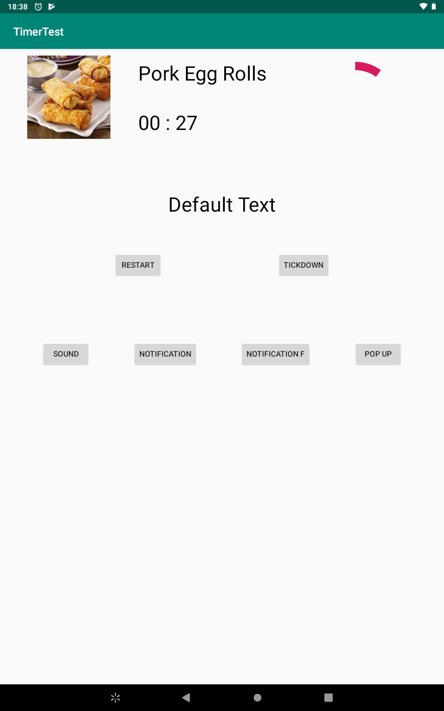
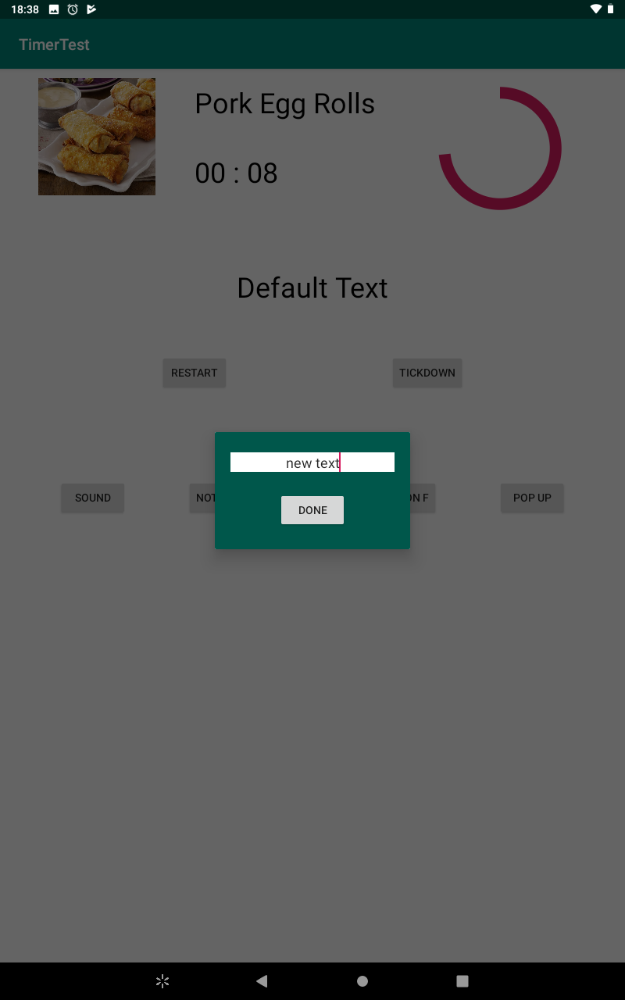
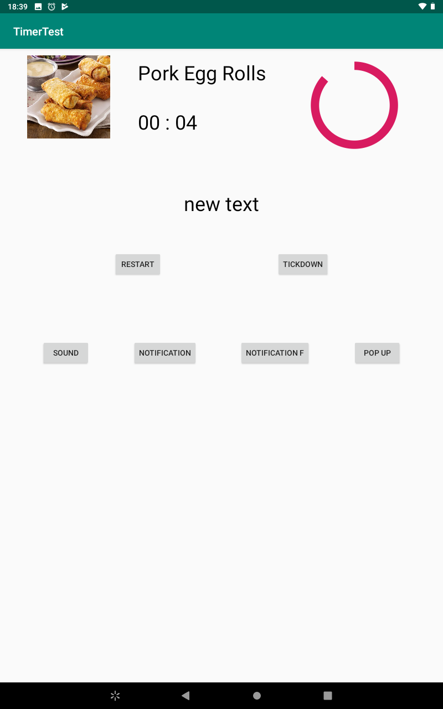
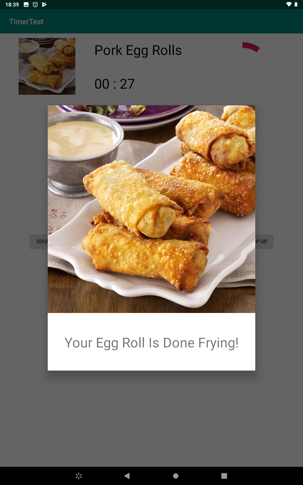
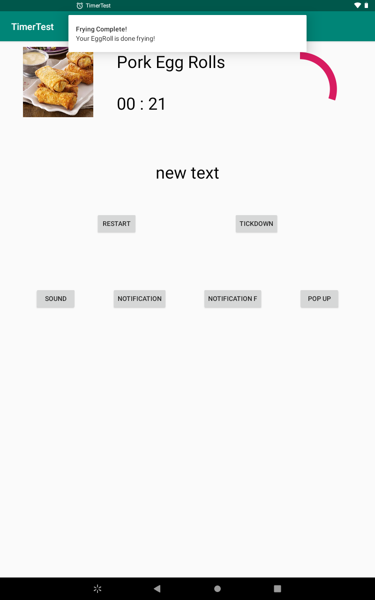

# TimerTest
A dirty project used to try out some features of android. Optimized for 7-8in screen tablet(Walmart 70bucks tablet)

Features tested:

1. ProgressBar
2. Timer (Handler+Runnable approach)
3. DialogFragment(With Shared ViewModel)
4. Notification pop up, Instant and Scheduled
5. Soundpool

# ScreenShots
1. The default look at start:

2. Click the popup button and change the text

3. Only if popup is dismissed by pressing done, will the base text change

4. Click sound to show the frying complete dialog with alarm sound, sound stops when dialog is dismissed

5. Click Notification to create a notification or Notification to schedule a notification for 10 seconds later

